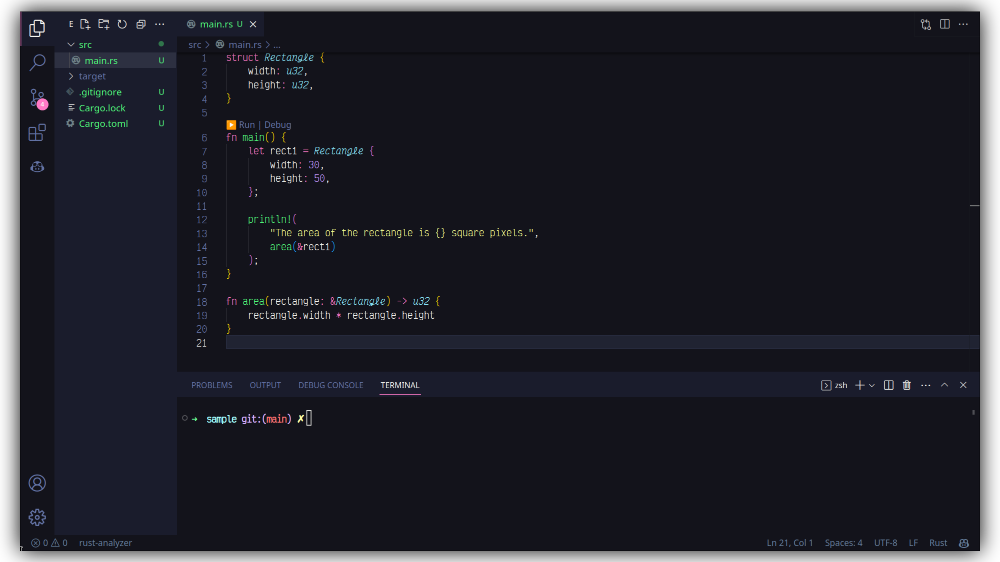

<div align="center">

# 1am Color Theme

\
[](https://marketplace.visualstudio.com/items?itemName=explodingcamera.1am) [](https://open-vsx.org/extension/explodingcamera/1am)

</div>

<br/>



## Recomended VSCode Settings

> To get the best experience with this theme, I recommend using the [Victor Mono](https://rubjo.github.io/victor-mono/) font

To enable italics in the VSCode editor, add the following to your `Settings.json`:

```jsonc
{
  "editor.fontFamily": "Victor Mono",
  "editor.tokenColorCustomizations": {
    "textMateRules": [
      {
        "scope": [
          //following will be in italic (=FlottFlott)
          "comment"
        ],
        "settings": {
          "fontStyle": "italic"
        }
      },
      {
        "scope": [
          //following will be excluded from italics (VSCode has some defaults for italics)
          "invalid",
          "keyword.operator",
          "constant.numeric.css",
          "keyword.other.unit.px.css",
          "constant.numeric.decimal.js",
          "constant.numeric.json"
        ],
        "settings": {
          "fontStyle": ""
        }
      }
    ]
  }
}
```
